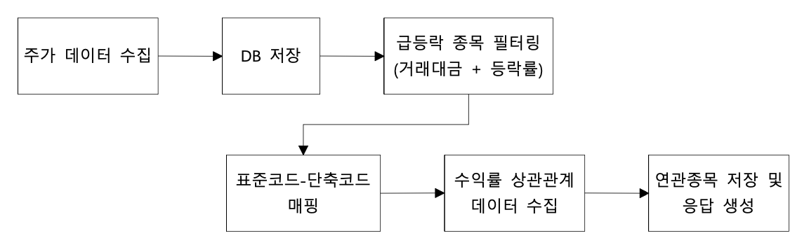

# UPssue 백엔드 급등락 연관종목 크롤링 서버

한국거래소(KRX) 데이터를 **역공학 기반 크롤링**하여 **급등락 종목 및 수익률 상관관계 종목들을 수집**하는 백엔드 시스템입니다.

수집된 데이터는 본 프로젝트의 주요 기능인 "**리포트 생성**"을 위한 파이프라인에 사용됩니다.

## ✅ 주요 기능

- **전체 주식 시세 데이터 수집**: KRX 웹사이트 역공학을 통한 전종목 주가 정보 크롤링
- **급등/급락 종목 필터링**: 거래대금 10억 이상, 등락률 ±6% 기준 필터링
- **종목별 수익률 상관관계 분석**: 100일 기준 상위 20개 연관 종목 분석
- **표준코드-단축코드 매핑**: KRX 종목 코드 이원 관리
- **스케줄된 자동 크롤링**: 평일 12:00, 23:00 KST 자동 실행

## ✅ 주요 특징

### 1. KRX API 역공학
- 한국거래소(KRX)는 공식 API를 제공하지 않기 때문에 웹사이트의 네트워크 요청을 분석하여 데이터 수집 방법을 자체적으로 구현해야 했습니다.
- 공식 API 없이도 실시간으로 데이터에 접근 가능하다는 것이 장점이지만, 웹사이트 구조 변경 시 유지보수, Rate Limiting 등 주의해야 하는 요소들이 있습니다.

### 2. 아키텍처 패턴
- **계층 분리**
   - Controller(main.py) -> Service -> Repository -> Database
   - Client: 외부 API 호출 전담

- **도메인 주도 설계(DDD) 요소**
   - features/ 하위에 도메인별 독립 모듈
   - 각 도메인: model, schema, service, repository, client 포함

### 3. 효율적 데이터 관리
- **Batch UPSERT**: MySQL의 `INSERT ... ON DUPLICATE KEY UPDATE` 활용

### 4. 이원 코드 관리
- **표준코드(12자리)**: KRX 내부 시스템용 (예: KR7005930003)
- **단축코드(6자리)**: 일반 사용자용 (예: 005930)

## ✅ 데이터 수집 흐름



1. **주가 데이터 수집**
   - KRX API에서 전종목 시세 데이터 조회 (전체 시장 기준)
   - stock_price_history 테이블에 배치 저장

2. **급등/급락 종목 필터링**
   - 거래대금 10억 이상
   - 급등: 등락률 +6% 이상
   - 급락: 등락률 -6% 이하

3. **표준코드 조회**
   - 필터링된 종목의 단축코드로 표준코드 조회
   - stock_code_mapping 테이블 참조

4. **상관관계 분석**
   - 각 종목별 100일 기준 수익률 상관관계 조회
   - 상위 20개 연관 종목 데이터 수집
   - stock_correlation 테이블에 저장

5. **응답 생성**
   - BaseStockCorrelationResponse 형식으로 결과 반환

## ✅ 기술 스택

| Type | Skills |
| :---: | --- |
| Backend & ORM | Python, SQLAlchemy, Pydantic |
| HTTP & 크롤링 | httpx, requests |
| 데이터베이스 | MySQL |
| 데이터 처리 | Pandas |
| 인프라 | Docker, Cron |

## ✅ 프로젝트 구조

```
catchtheme-BE-crawling/
├── main.py                          # 진입점, 크롤링 실행
├── requirements.txt                 # Python 의존성
├── docker-compose.yml              # MySQL + Scheduler 컨테이너 구성
├── Dockerfile                      # 메인 애플리케이션 이미지
├── Dockerfile.scheduler            # 크론 스케줄러 이미지
├── docker-entrypoint.sh            # 스케줄러 시작 스크립트
├── crontab                         # 크론 일정 설정
│
├── config/                          # 설정 모듈
│   ├── settings.py                 # 환경변수 기반 설정
│   ├── database.py                 # SQLAlchemy 엔진, 세션 설정
│   ├── constants.py                # KRX API 상수 정의
│   └── timezone.py                 # 한국 시간대 유틸리티
│
├── features/                        # 주요 기능 모듈
│   ├── stock_price/                 # 주가 시세 수집
│   │   ├── model.py                # StockPriceHistory ORM 모델
│   │   ├── schema.py               # Pydantic 스키마
│   │   ├── service.py              # 비즈니스 로직
│   │   ├── repository.py           # 데이터 접근 계층
│   │   └── krx_client.py           # KRX API 클라이언트
│   │
│   ├── correlation/                 # 상관관계 분석
│   │   ├── model.py                # StockCorrelation ORM 모델
│   │   ├── schema.py               # 응답 스키마
│   │   ├── service.py              # 상관관계 수집 및 저장
│   │   ├── repository.py           # 데이터 접근 계층
│   │   └── krx_correlation_client.py  # KRX 상관관계 API
│   │
│   └── stock_code_mapping/          # 종목 코드 매핑
│       ├── model.py                # StockCodeMapping ORM 모델
│       ├── schema.py               # Pydantic 스키마
│       ├── service.py              # 매핑 서비스
│       ├── repository.py           # 데이터 접근 계층
│       └── krx_client.py           # KRX 종목 코드 조회
│
└── scripts/                         # 유틸리티 스크립트
    ├── scheduler.py                # 평일 스케줄링 실행기
    └── init_db_once.py             # 데이터베이스 초기화
```

## ✅ 데이터베이스 스키마

### stock_price_history
주가 시세 데이터 저장

| 컬럼명 | 타입 | 설명 |
|--------|------|------|
| id | BigInteger | PK |
| stock_code | String(20) | 종목코드 |
| stock_name | String(100) | 종목명 |
| change_rate | Numeric(10,2) | 등락률 (%) |
| trading_value | BigInteger | 거래대금 (원) |
| target_date | Date | 시세 날짜 |
| created_at | DateTime | 생성 시간 |

- **Unique Key**: (stock_code, target_date)
- **Indexes**: stock_code, created_at, change_rate, trading_value, target_date

### stock_correlation
종목별 수익률 상관관계 데이터

| 컬럼명 | 타입 | 설명 |
|--------|------|------|
| id | BigInteger | PK |
| base_stock_code | String(20) | 기준 종목 표준코드 |
| trend_type | Enum | 급등(SURGE)/급락(PLUNGE) |
| correlated_stock_code | String(20) | 상관 종목 코드 |
| correlated_stock_name | String(100) | 상관 종목명 |
| correlation_rank | Integer | 상관순위 (1~20) |
| correlation_value | Numeric(10,4) | 상관계수 (0~1) |
| target_date | Date | 조회 날짜 |
| created_at | DateTime | 생성 시간 |

- **Unique Key**: (base_stock_code, correlated_stock_code, trend_type, target_date)
- **Indexes**: base_stock_code, target_date, trend_type, correlated_stock_code

### stock_code_mapping
표준코드-단축코드 매핑 테이블

| 컬럼명 | 타입 | 설명 |
|--------|------|------|
| standard_code | String(20) | 표준코드 (ISU_CD) - PK |
| short_code | String(20) | 단축코드 (ISU_SRT_CD) |
| stock_name_abbr | String(100) | 종목약명 |

- **Unique Key**: short_code
- **Indexes**: short_code, stock_name_abbr

## ✅ 설치 및 실행

### Docker Compose 사용 (권장)

```bash
# 컨테이너 시작
docker-compose up -d

# 로그 확인
docker-compose logs -f scheduler

# 컨테이너 종료
docker-compose down
```

### 로컬 실행

```bash
# 의존성 설치
pip install -r requirements.txt

# 환경변수 설정
cp .env.example .env
# .env 파일 수정

# 데이터베이스 초기화 및 크롤링 실행
python main.py
```

## ✅ 스케줄링

### Cron 설정

```cron
# 평일 12:00 KST - 정규장 종료 후 크롤링
0 12 * * 1-5 /usr/local/bin/python /app/scripts/scheduler.py >> /var/log/cron.log 2>&1

# 평일 23:00 KST - 저녁 데이터 재수집
0 23 * * 1-5 /usr/local/bin/python /app/scripts/scheduler.py >> /var/log/cron.log 2>&1
```

- **실행 시간**: 평일(월~금) 12시, 23시
- **주말 감지**: scheduler.py에서 토/일요일 자동 제외

## ✅ API 응답 형식

### BaseStockCorrelationResponse

```json
{
  "base_stock_code_name": "삼성전자",
  "base_stock_code": "005930",
  "change_rate": "2.5",
  "trend_type": "surge",
  "correlated_stocks": [
    {
      "stock_name": "SK하이닉스",
      "ticker": "000660"
    },
    {
      "stock_name": "LG전자",
      "ticker": "066570"
    }
  ]
}
```

### 필드 설명

- `base_stock_code_name`: 기준 종목명
- `base_stock_code`: 기준 종목 코드 (단축코드)
- `change_rate`: 등락률 (%)
- `trend_type`: 급등(surge) 또는 급락(plunge)
- `correlated_stocks`: 상관관계 종목 리스트 (상위 20개)
